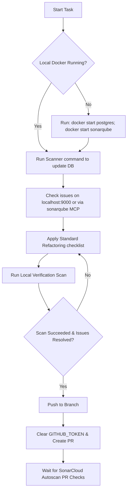

# SonarQube & SonarCloud Unified Workflow Skill

This skill provides a structured workflow for AI agents to analyze, refactor, and verify code quality using SonarQube (Local Docker Server) and SonarCloud (Cloud / GitHub PR integration).

---

## 1. Prerequisites & Container Management

Before running scans, ensure the local Docker databases and servers are running:

```powershell
# Start local containers
docker start postgres; docker start sonarqube
```

---

## 2. Configuration & Scan Commands

Depending on the workspace setup, the SonarScanner CLI docker command has two main execution styles:

### Option A: Standard Port Mapping (Local Host Bridge)
Use this option when the SonarQube container port is exposed directly to the host machine:

```powershell
docker run --rm -v "${pwd}:/usr/src" sonarsource/sonar-scanner-cli `
  "-Dsonar.projectKey=<PROJECT_KEY>" `
  "-Dsonar.token=<TOKEN>" `
  "-Dsonar.host.url=http://host.docker.internal:9000" `
  "-Dsonar.scm.disabled=true"
```

### Option B: Shared Docker Network
Use this option when the scanner must join the same network as the SonarQube container (e.g., in virtual host environments or monorepos):

```powershell
docker run --rm --network=sonarqube-docker_default -v "${pwd}:/usr/src" sonarsource/sonar-scanner-cli `
  "-Dsonar.projectKey=<PROJECT_KEY>" `
  "-Dsonar.sources=." `
  "-Dsonar.host.url=http://sonarqube:9000" `
  "-Dsonar.token=<TOKEN>" `
  "-Dsonar.scm.disabled=true"
```

---

## 2.5. Prevention of False Positive Gating (Properties Configuration)

To prevent false positive quality gate failures (e.g., high duplication reported on test suites), agents **MUST** always verify that test files are properly partitioned and excluded from CPD (Copy-Paste Detection) duplication checks.

Ensure both `sonar-project.properties` (for local scans) and `.sonarcloud.properties` (for SonarCloud Automatic Analysis) in the project root are updated and synchronized with the following parameters:

### sonar-project.properties
```properties
sonar.sources=packages
sonar.exclusions=**/__tests__/**,**/*.test.ts,**/*.spec.ts,refs/**,**/node_modules/**,**/dist/**,**/prototype/**
sonar.tests=packages
sonar.test.inclusions=**/__tests__/**/*.ts,**/*.test.ts,**/*.spec.ts
sonar.cpd.exclusions=**/__tests__/**,**/*.test.ts,**/*.spec.ts
```

### .sonarcloud.properties
```properties
sonar.exclusions=**/__tests__/**,**/*.test.ts,**/*.spec.ts,refs/**,**/node_modules/**,**/dist/**,**/prototype/**
sonar.test.inclusions=**/__tests__/**/*.ts,**/*.test.ts,**/*.spec.ts
sonar.cpd.exclusions=**/__tests__/**,**/*.test.ts,**/*.spec.ts
```

---

## 3. Configuration of MCP Servers

Ensure `mcp_config.json` defines both servers under `mcpServers` so they can be queried on-the-fly:

```json
    "sonarqube": {
      "command": "docker",
      "args": [
        "run",
        "-i",
        "--rm",
        "-e",
        "SONARQUBE_TOKEN",
        "-e",
        "SONARQUBE_ORG",
        "-e",
        "SONARQUBE_URL",
        "mcp/sonarqube",
        "stdio"
      ],
      "env": {
        "SONARQUBE_ORG": "-",
        "SONARQUBE_TOKEN": "YOUR_LOCAL_TOKEN",
        "SONARQUBE_URL": "http://host.docker.internal:9000"
      }
    },
    "sonarcloud": {
      "command": "docker",
      "args": [
        "run",
        "-i",
        "--rm",
        "-e",
        "SONARQUBE_TOKEN",
        "-e",
        "SONARQUBE_ORG",
        "-e",
        "SONARQUBE_URL",
        "mcp/sonarqube",
        "stdio"
      ],
      "env": {
        "SONARQUBE_ORG": "<YOUR_ORGANIZATION_KEY>",
        "SONARQUBE_TOKEN": "YOUR_SONARCLOUD_TOKEN",
        "SONARQUBE_URL": "https://sonarcloud.io"
      }
    }
```

---

## 4. Execution Workflow



---

## 5. Refactoring Standard Violations

Always apply the following clean-code refactoring rules:

| Violation | Diagnosis / Pattern | Resolution |
| :--- | :--- | :--- |
| **Cognitive Complexity (S3776)** | Nested loops, `try-catch` blocks, complex `if-else` within one function. | Extract inner loops or heavy operations into helper functions. |
| **Optional Chaining (S6582)** | Legacy truthy checks like `(error && error.stack)` or `if (obj && obj.prop)`. | Convert to `error?.stack` or `obj?.prop`. |
| **Replace vs ReplaceAll (S7781)** | String replacements using regex `/g` flags: `str.replace(/_/g, '-')`. | Convert to string literals: `str.replaceAll('_', '-')`. |
| **Set membership (S7776)** | Sequential array lookup: `candidates.includes(val)`. | Convert to `new Set(candidates)` and use `candidates.has(val)`. |
| **globalThis (S7764)** | Using legacy environment globals: `window.api`. | Replace with `globalThis.api`. |
| **RegExp.exec() (S6594)** | `str.match(regex)`. | Replace with `regex.exec(str)`. |
| **Redundant unions (S6571)** | Typings like `any | null` or `any | undefined`. | Simplify to `any`. |

---

## 6. GitHub CLI Commands (Safe Keyring Access)

When checking pull request checks or merging, you must clear the default sandbox dummy token:

```powershell
# Safe PR status check
$env:GITHUB_TOKEN=$null; gh pr checks <pr_number>

# Safe PR creation
$env:GITHUB_TOKEN=$null; gh pr create --head <branch_name> --title "<title>" --body "<body>"

# Safe PR merge
$env:GITHUB_TOKEN=$null; gh pr merge <pr_number> --merge --delete-branch
```
