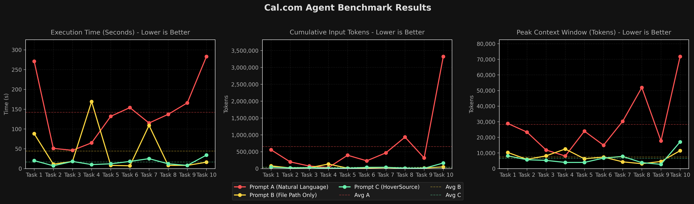

# Cal.com Benchmark Results

This document records the benchmark metrics for the Cal.com tasks (Tasks 1 to 10), comparing the performance of the AI coding agent under three different prompt variations:
1. **Prompt A**: Pure Natural Language
2. **Prompt B**: File Path Only
3. **Prompt C**: HoverSource Metadata

---

## Consolidated Summary (Averages)

| Metric | Pure Natural Language (A) | File Path Only (B) | HoverSource Metadata (C) | Delta (B vs A) | Delta (C vs A) |
| :--- | :---: | :---: | :---: | :---: | :---: |
| **Task Achievement** | 60.0% (6/10) | 100.0% (10/10) | 100.0% (10/10) | **+66.7%** | **+66.7%** |
| **Avg Agent Steps** | 65.6 | 18.0 | 17.1 | -72.6% | **-73.9%** |
| **Avg Tool Calls** | 30.5 | 6.5 | 5.9 | -78.7% | **-80.7%** |
| **Avg Execution Time** | 142.0s | 44.2s | 16.4s | -68.9% (3.2x) | **-88.5%** (8.7x) |
| **Avg Cumulative Input** | 651,681 | 37,858 | 35,733 | -94.2% (17.2x) | **-94.5%** (18.2x) |
| **Avg Peak Context** | 28,257 | 7,372 | 6,486 | -73.9% | **-77.0%** |

---

## Task-by-Task Metrics

### Task 1: Dropdown Destructive MenuItem (Delete Option)
* **Goal**: Change the hover effect of the Delete option in the dropdown menu to be smoother with a softer red tone.
* **Full Session Logs**: [Prompt A Log](logs/calcom-task1-a.md) | [Prompt B Log](logs/calcom-task1-b.md) | [Prompt C Log](logs/calcom-task1-c.md)

| Metric | Pure Natural Language (A) | File Path Only (B) | HoverSource Metadata (C) | Delta (B vs A) | Delta (C vs A) |
| :--- | :---: | :---: | :---: | :---: | :---: |
| **Task Achievement** | 1 | 1 | 1 | - | - |
| **Agent Steps** | 68 | 26 | 18 | -61.8% | **-73.5%** |
| **Tool Calls** | 31 | 10 | 6 | -67.7% | **-80.6%** |
| **Execution Time** | 271s | 88s | 20s | -67.5% (3.1x) | **-92.6%** (13.6x) |
| **Cumulative Input** | 557,132 | 78,703 | 39,401 | -85.9% (7.1x) | **-92.9%** (14.1x) |
| **Peak Context** | 28,868 | 10,265 | 8,101 | -64.4% | **-71.9%** |

---

### Task 2: Primary Action Button
* **Goal**: Update the styling of our primary action buttons to have a subtle scale-up animation on hover and scale-down on active press.
* **Full Session Logs**: [Prompt A Log](logs/calcom-task2-a.md) | [Prompt B Log](logs/calcom-task2-b.md) | [Prompt C Log](logs/calcom-task2-c.md)

| Metric | Pure Natural Language (A) | File Path Only (B) | HoverSource Metadata (C) | Delta (B vs A) | Delta (C vs A) |
| :--- | :---: | :---: | :---: | :---: | :---: |
| **Task Achievement** | 0 | 1 | 1 | - | - |
| **Agent Steps** | 43 | 12 | 12 | **-72.1%** | **-72.1%** |
| **Tool Calls** | 20 | 3 | 3 | **-85.0%** | **-85.0%** |
| **Execution Time** | 51s | 11s | 7s | -78.4% (4.6x) | **-86.3%** (7.3x) |
| **Cumulative Input** | 197,226 | 17,143 | 19,209 | **-91.3%** (11.5x) | -90.3% (10.3x) |
| **Peak Context** | 23,335 | 5,874 | 5,644 | -74.8% | **-75.8%** |

> [!WARNING]
> **Pure Natural Language (A) Project Misidentification:**
> In Task 2, Subagent A got confused by the multi-project monorepo and modified the `HoverSource` companion-server frontend instead of the target `cal.diy` application. This resulted in a **failed task (Task Achievement = 0)**.

---

### Task 3: Form Input TextField
* **Goal**: Make the focus state border of the text input wrapper more prominent by changing it to use the brand-default color with a matching focus ring.
* **Full Session Logs**: [Prompt A Log](logs/calcom-task3-a.md) | [Prompt B Log](logs/calcom-task3-b.md) | [Prompt C Log](logs/calcom-task3-c.md)

| Metric | Pure Natural Language (A) | File Path Only (B) | HoverSource Metadata (C) | Delta (B vs A) | Delta (C vs A) |
| :--- | :---: | :---: | :---: | :---: | :---: |
| **Task Achievement** | 1 | 1 | 1 | - | - |
| **Agent Steps** | 32 | 12 | 18 | **-62.5%** | -43.8% |
| **Tool Calls** | 14 | 4 | 6 | **-71.4%** | -57.1% |
| **Execution Time** | 46s | 18s | 18s | **-60.9%** (2.6x) | **-60.9%** (2.6x) |
| **Cumulative Input** | 74,535 | 23,355 | 27,613 | **-68.7%** (3.2x) | -63.0% (2.7x) |
| **Peak Context** | 11,868 | 8,130 | 5,222 | -31.5% | **-56.0%** |

---

### Task 4: User Dropdown Status Indicator (Green Dot)
* **Goal**: Update the online status indicator dot next to the avatar to be slightly larger and stand out with a white border.
* **Full Session Logs**: [Prompt A Log](logs/calcom-task4-a.md) | [Prompt B Log](logs/calcom-task4-b.md) | [Prompt C Log](logs/calcom-task4-c.md)

| Metric | Pure Natural Language (A) | File Path Only (B) | HoverSource Metadata (C) | Delta (B vs A) | Delta (C vs A) |
| :--- | :---: | :---: | :---: | :---: | :---: |
| **Task Achievement** | 1 | 1 | 1 | - | - |
| **Agent Steps** | 27 | 44 | 10 | +63.0% | **-63.0%** |
| **Tool Calls** | 15 | 19 | 3 | +26.7% | **-80.0%** |
| **Execution Time** | 65s | 169s | 10s | +160.0% (0.4x) | **-84.6%** (6.5x) |
| **Cumulative Input** | 29,604 | 133,522 | 8,730 | +351.0% (0.2x) | **-70.5%** (3.4x) |
| **Peak Context** | 8,022 | 12,509 | 3,914 | +55.9% | **-51.2%** |

> [!NOTE]
> **Observation on File Path Only (B) Cognitive Overhead:**
> In this task, the File Path Only prompt (B) took significantly longer (+160.0%) and consumed more tokens (+351.0%) than the Pure Natural Language prompt (A). 
> Because Prompt B provided the file path but left the design decisions open-ended, the agent attempted to analyze the entire component's layout logic. This created substantial **cognitive overhead**, leading to deep reasoning loops and extra tool calls.

---

### Task 5: Search Command Palette Button (Kbar)
* **Goal**: Style the quick search/kbar trigger button so it looks more like a distinct button by adding a subtle border and making the hover background lighter.
* **Full Session Logs**: [Prompt A Log](logs/calcom-task5-a.md) | [Prompt B Log](logs/calcom-task5-b.md) | [Prompt C Log](logs/calcom-task5-c.md)

| Metric | Pure Natural Language (A) | File Path Only (B) | HoverSource Metadata (C) | Delta (B vs A) | Delta (C vs A) |
| :--- | :---: | :---: | :---: | :---: | :---: |
| **Task Achievement** | 1 | 1 | 1 | - | - |
| **Agent Steps** | 66 | 8 | 10 | **-87.9%** | -84.8% |
| **Tool Calls** | 30 | 2 | 3 | **-93.3%** | -90.0% |
| **Execution Time** | 132s | 8s | 12s | **-93.9%** (16.5x) | -90.9% (11.0x) |
| **Cumulative Input** | 394,524 | 11,686 | 8,209 | -97.0% (33.8x) | **-97.9%** (48.1x) |
| **Peak Context** | 23,956 | 6,243 | 3,930 | -73.9% | **-83.6%** |

---

### Task 6: Sidebar Navigation Links
* **Goal**: Adjust the spacing of the sidebar navigation items to increase the vertical gap between them.
* **Full Session Logs**: [Prompt A Log](logs/calcom-task6-a.md) | [Prompt B Log](logs/calcom-task6-b.md) | [Prompt C Log](logs/calcom-task6-c.md)

| Metric | Pure Natural Language (A) | File Path Only (B) | HoverSource Metadata (C) | Delta (B vs A) | Delta (C vs A) |
| :--- | :---: | :---: | :---: | :---: | :---: |
| **Task Achievement** | 0 | 1 | 1 | - | - |
| **Agent Steps** | 56 | 10 | 22 | **-82.1%** | -60.7% |
| **Tool Calls** | 25 | 3 | 8 | **-88.0%** | -68.0% |
| **Execution Time** | 154s | 7s | 18s | **-95.5%** (22.0x) | -88.3% (8.6x) |
| **Cumulative Input** | 229,086 | 16,046 | 35,428 | **-93.0%** (14.3x) | -84.5% (6.5x) |
| **Peak Context** | 14,934 | 7,332 | 6,705 | -50.9% | **-55.1%** |

> [!WARNING]
> **Pure Natural Language (A) Component Misidentification:**
> In this task, Subagent A got confused and modified the wrong components. Instead of adjusting the main sidebar links inside `apps/web/modules/shell/navigation/Navigation.tsx`, it modified the `VerticalTabs.tsx` under `packages/ui`. This resulted in a **failed task (Task Achievement = 0)**.

---

### Task 7: Settings Section Header
* **Goal**: Add a subtle horizontal dividing line at the bottom of the Settings header to separate it cleanly from the settings forms.
* **Full Session Logs**: [Prompt A Log](logs/calcom-task7-a.md) | [Prompt B Log](logs/calcom-task7-b.md) | [Prompt C Log](logs/calcom-task7-c.md)

| Metric | Pure Natural Language (A) | File Path Only (B) | HoverSource Metadata (C) | Delta (B vs A) | Delta (C vs A) |
| :--- | :---: | :---: | :---: | :---: | :---: |
| **Task Achievement** | 1 | 1 | 1 | - | - |
| **Agent Steps** | 48 | 26 | 16 | -45.8% | **-66.7%** |
| **Tool Calls** | 21 | 10 | 5 | -52.4% | **-76.2%** |
| **Execution Time** | 115s | 109s | 25s | -5.2% (1.1x) | **-78.3%** (4.6x) |
| **Cumulative Input** | 465,434 | 28,607 | 37,441 | **-93.9%** (16.3x) | -92.0% (12.4x) |
| **Peak Context** | 30,272 | 4,297 | 7,773 | **-85.8%** | -74.3% |

---

### Task 8: EmptyScreen Container (Redesigned)
* **Goal**: Change the dashed border of the empty screen container to a solid subtle border, and add a soft background color (`bg-subtle`).
* **Full Session Logs**: [Prompt A Log](logs/calcom-task8-a.md) | [Prompt B Log](logs/calcom-task8-b.md) | [Prompt C Log](logs/calcom-task8-c.md)

| Metric | Pure Natural Language (A) | File Path Only (B) | HoverSource Metadata (C) | Delta (B vs A) | Delta (C vs A) |
| :--- | :---: | :---: | :---: | :---: | :---: |
| **Task Achievement** | 1 | 1 | 1 | - | - |
| **Agent Steps** | 70 | 10 | 12 | **-85.7%** | -82.9% |
| **Tool Calls** | 32 | 3 | 4 | **-90.6%** | -87.5% |
| **Execution Time** | 137s | 8s | 12s | **-94.2%** (17.1x) | -91.2% (11.4x) |
| **Cumulative Input** | 932,759 | 5,714 | 10,782 | **-99.4%** (163.2x) | -98.8% (86.5x) |
| **Peak Context** | 51,886 | 3,105 | 3,777 | **-94.0%** | -92.7% |

---

### Task 9: Main Application Shell Wrapper
* **Goal**: Set a maximum width for the shell layout container so it doesn't stretch infinitely, and center it horizontally.
* **Full Session Logs**: [Prompt A Log](logs/calcom-task9-a.md) | [Prompt B Log](logs/calcom-task9-b.md) | [Prompt C Log](logs/calcom-task9-c.md)

| Metric | Pure Natural Language (A) | File Path Only (B) | HoverSource Metadata (C) | Delta (B vs A) | Delta (C vs A) |
| :--- | :---: | :---: | :---: | :---: | :---: |
| **Task Achievement** | 1 | 1 | 1 | - | - |
| **Agent Steps** | 62 | 14 | 10 | -77.4% | **-83.9%** |
| **Tool Calls** | 28 | 4 | 3 | -85.7% | **-89.3%** |
| **Execution Time** | 166s | 8s | 8s | **-95.2%** (20.8x) | **-95.2%** (20.8x) |
| **Cumulative Input** | 314,581 | 14,514 | 6,938 | -95.4% (21.7x) | **-97.8%** (45.3x) |
| **Peak Context** | 17,685 | 4,529 | 2,711 | -74.4% | **-84.7%** |

---

### Task 10: Availability View Empty State Text
* **Goal**: Make the helper text at the bottom of the availability view easier to read by increasing the font size and changing the text color to a higher contrast variant.
* **Full Session Logs**: [Prompt A Log](logs/calcom-task10-a.md) | [Prompt B Log](logs/calcom-task10-b.md) | [Prompt C Log](logs/calcom-task10-c.md)

| Metric | Pure Natural Language (A) | File Path Only (B) | HoverSource Metadata (C) | Delta (B vs A) | Delta (C vs A) |
| :--- | :---: | :---: | :---: | :---: | :---: |
| **Task Achievement** | 0 | 1 | 1 | - | - |
| **Agent Steps** | 184 | 18 | 43 | **-90.2%** | -76.6% |
| **Tool Calls** | 89 | 7 | 18 | **-92.1%** | -79.8% |
| **Execution Time** | 283s | 16s | 34s | **-94.3%** (17.7x) | -88.0% (8.3x) |
| **Cumulative Input** | 3,321,931 | 49,285 | 163,583 | **-98.5%** (67.4x) | -95.1% (20.3x) |
| **Peak Context** | 71,744 | 11,431 | 17,078 | **-84.1%** | -76.2% |

> [!WARNING]
> **Pure Natural Language (A) Component Misidentification:**
> In Task 10, Subagent A got confused and modified the wrong file. Instead of modifying the helper text at the bottom of the main availability schedule editor list (`apps/web/modules/availability/availability-view.tsx`), it modified the `DateOverride` component's description text inside `packages/platform/atoms/availability/AvailabilitySettings.tsx`. This resulted in a **failed task (Task Achievement = 0)**.

---
