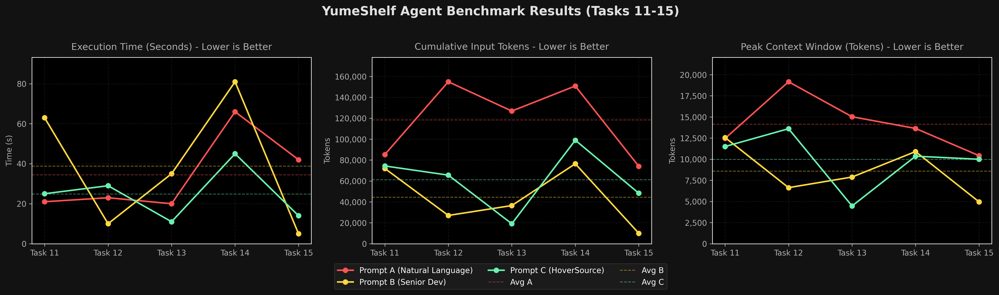

# YumeShelf Benchmark Results

This document records the benchmark metrics for the YumeShelf tasks (Tasks 11 to 15), comparing the performance of the AI coding agent under three different prompt variations:
1. **Prompt A**: Pure Natural Language
2. **Prompt B**: Senior Developer Context
3. **Prompt C**: HoverSource Metadata

---

## Consolidated Summary (Averages)

| Metric | Pure Natural Language (A) | Senior Developer (B) | HoverSource Metadata (C) | Delta (B vs A) | Delta (C vs A) |
| :--- | :---: | :---: | :---: | :---: | :---: |
| **Task Achievement** | 100.0% (5/5) | 100.0% (5/5) | 100.0% (5/5) | - | - |
| **Avg Agent Steps** | 34.4 | 22.0 | 26.0 | -36.0% | **-24.4%** |
| **Avg Tool Calls** | 15.2 | 8.8 | 11.0 | -42.1% | **-27.6%** |
| **Avg Execution Time** | 34.4s | 38.8s | 24.8s | +12.8% | **-27.9%** (1.4x) |
| **Avg Cumulative Input** | 118,354 | 44,382 | 61,255 | -62.5% (2.7x) | **-48.2%** (1.9x) |
| **Avg Peak Context** | 14,140 | 8,589 | 9,984 | -39.3% | **-29.4%** |

---

## Task-by-Task Metrics

### Task 11: Favorite Button in Stack Card
* **Goal**: Change the visual styling of the active favorite button inside game stack cards from bright gold to a softer pastel gold color.
* **Full Session Logs**: [Prompt A Log](logs/yumeshelf-task11-a.md) | [Prompt B Log](logs/yumeshelf-task11-b.md) | [Prompt C Log](logs/yumeshelf-task11-c.md)

| Metric | Pure Natural Language (A) | Senior Developer (B) | HoverSource Metadata (C) | Delta (B vs A) | Delta (C vs A) |
| :--- | :---: | :---: | :---: | :---: | :---: |
| **Task Achievement** | 1 | 1 | 1 | - | - |
| **Agent Steps** | 26 | 32 | 30 | +23.1% | +15.4% |
| **Tool Calls** | 11 | 13 | 13 | +18.2% | +18.2% |
| **Execution Time** | 21.0s | 63.0s | 25.0s | +200.0% | +19.0% |
| **Cumulative Input** | 85,262 | 71,951 | 74,337 | -15.6% | -12.8% |
| **Peak Context** | 12,454 | 12,562 | 11,500 | +0.9% | -7.7% |

> [!NOTE]
> **Observation on CSS vs JS implementations:**
> Subagent B was constrained to edit `src/renderer/stack-cards.ts`, leading it to inject the style inline programmatically via JS, which took longer and was less elegant. 
> Subagents A and C both correctly targeted the global stylesheet `src/styles/game-cards.css` to update the native style rule.

---

### Task 12: Game Card Component Glow
* **Goal**: Tone down the intense gold shadow glow of the favorited game cards to make it more subtle in the library grid.
* **Full Session Logs**: [Prompt A Log](logs/yumeshelf-task12-a.md) | [Prompt B Log](logs/yumeshelf-task12-b.md) | [Prompt C Log](logs/yumeshelf-task12-c.md)

| Metric | Pure Natural Language (A) | Senior Developer (B) | HoverSource Metadata (C) | Delta (B vs A) | Delta (C vs A) |
| :--- | :---: | :---: | :---: | :---: | :---: |
| **Task Achievement** | 1 | 1 | 1 | - | - |
| **Agent Steps** | 32 | 16 | 30 | -50.0% | -6.3% |
| **Tool Calls** | 14 | 6 | 13 | -57.1% | -7.1% |
| **Execution Time** | 23.0s | 10.0s | 29.0s | -56.5% | +26.1% |
| **Cumulative Input** | 154,843 | 27,024 | 65,580 | -82.5% | -57.6% |
| **Peak Context** | 19,162 | 6,634 | 13,606 | -65.4% | -29.0% |

---

### Task 13: Library Game Grid Column Size
* **Goal**: Adjust the grid layout to increase the minimum column width so that game card columns are wider and titles don't get cut off.
* **Full Session Logs**: [Prompt A Log](logs/yumeshelf-task13-a.md) | [Prompt B Log](logs/yumeshelf-task13-b.md) | [Prompt C Log](logs/yumeshelf-task13-c.md)

| Metric | Pure Natural Language (A) | Senior Developer (B) | HoverSource Metadata (C) | Delta (B vs A) | Delta (C vs A) |
| :--- | :---: | :---: | :---: | :---: | :---: |
| **Task Achievement** | 1 | 1 | 1 | - | - |
| **Agent Steps** | 34 | 22 | 16 | -35.3% | **-52.9%** |
| **Tool Calls** | 15 | 9 | 6 | -40.0% | **-60.0%** |
| **Execution Time** | 20.0s | 35.0s | 11.0s | +75.0% | **-45.0%** (1.8x) |
| **Cumulative Input** | 126,837 | 36,492 | 19,092 | -71.2% | **-84.9%** (6.6x) |
| **Peak Context** | 15,023 | 7,889 | 4,465 | -47.5% | **-70.3%** |

---

### Task 14: Delete Game Dropdown Item Style
* **Goal**: Change the style of the delete dropdown option so that its red background is transparent by default and only appears on hover.
* **Full Session Logs**: [Prompt A Log](logs/yumeshelf-task14-a.md) | [Prompt B Log](logs/yumeshelf-task14-b.md) | [Prompt C Log](logs/yumeshelf-task14-c.md)

| Metric | Pure Natural Language (A) | Senior Developer (B) | HoverSource Metadata (C) | Delta (B vs A) | Delta (C vs A) |
| :--- | :---: | :---: | :---: | :---: | :---: |
| **Task Achievement** | 1 | 1 | 1 | - | - |
| **Agent Steps** | 52 | 30 | 34 | -42.3% | **-34.6%** |
| **Tool Calls** | 24 | 13 | 15 | -45.8% | **-37.5%** |
| **Execution Time** | 66.0s | 81.0s | 45.0s | +22.7% | **-31.8%** (1.5x) |
| **Cumulative Input** | 150,786 | 76,446 | 98,984 | -49.3% | **-34.4%** |
| **Peak Context** | 13,639 | 10,903 | 10,355 | -20.1% | **-24.1%** |

> [!NOTE]
> **Observation on Prompt B Constraint:**
> Similar to Task 11, Prompt B forced the agent to edit `src/renderer/game-cards.ts`, causing it to implement inline style listeners in JS (`onmouseover` and `onmouseout`), whereas A and C targeted the CSS stylesheet `src/styles/menus-tooltips.css` directly.

---

### Task 15: Library Path Link in Settings
* **Goal**: Update the library path links to behave like standard links by adding an underline and pointer cursor on hover.
* **Full Session Logs**: [Prompt A Log](logs/yumeshelf-task15-a.md) | [Prompt B Log](logs/yumeshelf-task15-b.md) | [Prompt C Log](logs/yumeshelf-task15-c.md)

| Metric | Pure Natural Language (A) | Senior Developer (B) | HoverSource Metadata (C) | Delta (B vs A) | Delta (C vs A) |
| :--- | :---: | :---: | :---: | :---: | :---: |
| **Task Achievement** | 1 | 1 | 1 | - | - |
| **Agent Steps** | 28 | 10 | 20 | **-64.3%** | -28.6% |
| **Tool Calls** | 12 | 3 | 8 | **-75.0%** | -33.3% |
| **Execution Time** | 42.0s | 5.0s | 14.0s | **-88.1%** (8.4x) | -66.7% (3.0x) |
| **Cumulative Input** | 74,040 | 9,996 | 48,281 | **-86.5%** (7.4x) | -34.8% (1.5x) |
| **Peak Context** | 10,422 | 4,955 | 9,992 | **-52.5%** | -4.1% |

---

## Architectural Case Study: Presentation-Logic Separation vs. Context Overhead

In **Task 11** and **Task 14**, the choice of target context led to distinct architectural results in the generated code patches:

### Prompt B (Manual Controller Context)
When provided only with the controller file path (`stack-cards.ts` or `game-cards.ts`), the agent confined its code modifications to those specific TypeScript files. To achieve the requested visual changes (hover states), it programmatically injected inline styling attributes and added JavaScript event listeners (`onmouseover`, `onmouseout`). This resulted in a functional patch but violated best-practice separation of concerns by coupling styling rules inside the application logic.

### Prompt C (HoverSource Metadata)
By providing the exact target CSS selector and stylesheet source file (`game-cards.css` or `menus-tooltips.css`), Prompt C enabled the agent to locate the appropriate style rules. The agent modified the native CSS stylesheets directly, preserving the project's styling conventions and keeping logical controllers separate from presentation details. 

Although Prompt C required slightly more tokens in these medium-sized tasks due to the inclusion of the metadata block, the resulting patches preserved the codebase's original design integrity.

